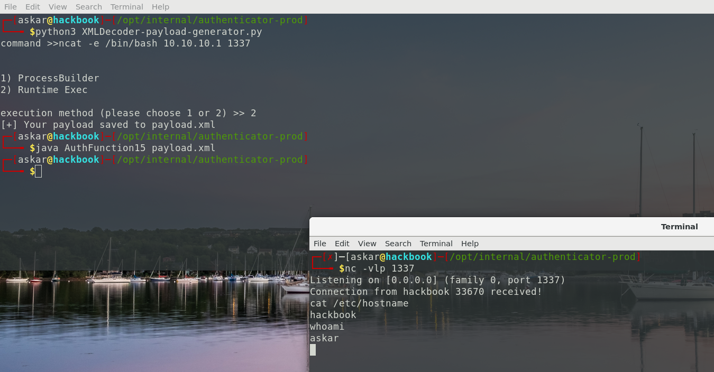

# README
XMLDecoder payload generator
----------------------------

A simple python script to generate XML payloads works for Java XMLDecoder based on ProcessBuilder and Runtime exec.

You can use this script to generate XML payloads which you can use with XMLDecoder java function.

